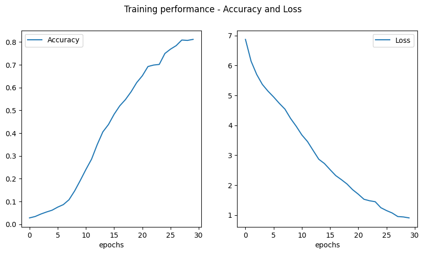

# Shakespeare Next Word Prediction with LSTM 📜✒️

[](https://www.tensorflow.org/)
[](https://keras.io/)
[](https://www.python.org/)
[](https://numpy.org/)
[](https://matplotlib.org/)

## Overview 📖

This project implements a **next-word prediction model** using TensorFlow and Keras to generate text in the style of Shakespeare's sonnets. The neural network is trained on a corpus of Shakespeare's work and learns to predict the next word in a sequence, allowing it to generate new, Shakespeare-like text.

However there is a twist to this exercise... Like a Jedi apprentice learning to wield the Force, this neural network learns to wield the language of the Bard, predicting word patterns and generating text that mimics Shakespeare's unique style.

---

## Features ✨

- **Text Vectorization Layer**: Converts raw text into numerical sequences
- **N-gram Generation**: Creates input-target pairs for training
- **Bidirectional LSTM Architecture**: Captures context in both directions for better prediction
- **Word Embeddings**: Learns semantic relationships between words
- **Interactive Text Generation**: Generates new text from a seed phrase

---

## Dataset 📚

- **Source**: Shakespeare Sonnets corpus
- **Content**: Over 2,100 lines of text from Shakespeare's sonnets
- **Format**: Text file with one line per sonnet line
- **Processing**: Text is standardized, tokenized, and converted to n-grams for training
- **Vocabulary Size**: Approximately 3,200 unique words

---

## Model Architecture 🏗️

The model uses a sophisticated architecture to learn the patterns in Shakespeare's language:

```
Input Layer (variable length sequences)
    ↓
Text Vectorization (3,189 vocab size)
    ↓
Embedding Layer (100 dimensions)
    ↓
Bidirectional LSTM (128 units)
    ↓
Dense Layer (3,189 units, softmax)
    ↓
Next Word Prediction
```

**Key Parameters:**
- Vocabulary Size: 3,189 tokens
- Embedding Dimensions: 100
- LSTM Units: 128
- Batch Size: 16
- Sequence Padding: 'pre'
- Loss Function: Categorical Cross-Entropy
- Optimizer: Adam

---

## Implementation Details 🔍

The implementation follows these key steps:

1. **Text Processing**:
   - Convert text to lowercase
   - Remove punctuation
   - Create a vocabulary from unique words

2. **N-gram Generation**:
   - Convert text lines to token sequences
   - Create n-grams of various lengths from each line
   - For each n-gram, the last word becomes the target label

3. **Data Preparation**:
   - Pad sequences to a uniform length
   - One-hot encode target words
   - Create a TensorFlow dataset with batching

4. **Model Training**:
   - Train the model for 30 epochs
   - Monitor accuracy and loss metrics

5. **Text Generation**:
   - Use a seed text to start generation
   - Predict the next word based on preceding words
   - Add the predicted word to the sequence and repeat

---

## Getting Started 🚀

### Prerequisites

- Python 3.x
- TensorFlow 2.x
- NumPy
- Matplotlib

### Installation

```bash
git clone https://github.com/yourusername/shakespeare-next-word-prediction
cd shakespeare-next-word-prediction
pip install -r requirements.txt
```

### Usage

1. Train the model:
```python
# Load the dataset
with open('data/sonnets.txt') as f:
    data = f.read()
corpus = data.lower().split("\n")

# Process the data and train the model
vectorizer = fit_vectorizer(corpus)
input_sequences = n_gram_seqs(corpus, vectorizer)
max_sequence_len = max([len(x) for x in input_sequences])
input_sequences = pad_seqs(input_sequences, max_sequence_len)
dataset = features_and_labels_dataset(input_sequences, total_words).prefetch(tf.data.AUTOTUNE)
model = create_model(total_words, max_sequence_len)
history = model.fit(dataset, epochs=30, verbose=1)
```

2. Generate text using the trained model:
```python
seed_text = "Shall I compare thee to a summer's day"
next_words = 50

for _ in range(next_words):
    token_list = vectorizer(seed_text)
    token_list = tf.keras.utils.pad_sequences([token_list], maxlen=max_sequence_len-1, padding='pre')
    predicted = model.predict([token_list], verbose=0)
    predicted = np.argmax(predicted, axis=-1).item()
    output_word = vectorizer.get_vocabulary()[predicted]
    seed_text += " " + output_word

print(seed_text)
```

---

## Implementation Highlights ⭐

### Text Vectorization Layer

```python
def fit_vectorizer(corpus):
    vectorizer = tf.keras.layers.TextVectorization(
        standardize='lower_and_strip_punctuation',
        ragged=True
    )
    vectorizer.adapt(corpus)
    return vectorizer
```

### N-gram Sequence Generation

```python
def n_gram_seqs(corpus, vectorizer):
    input_sequences = []
    for line in corpus:
        token_list = vectorizer([line])[0]
        for i in range(1, len(token_list)):
            n_gram = token_list[0:i+1]
            input_sequences.append(n_gram)
    return input_sequences
```

### Bidirectional LSTM Model

```python
def create_model(total_words, max_sequence_len):
    model = tf.keras.Sequential()
    model.add(tf.keras.layers.Input(shape=(max_sequence_len-1,)))
    model.add(tf.keras.layers.Embedding(total_words, EMBEDDING_DIM))
    model.add(tf.keras.layers.Bidirectional(tf.keras.layers.LSTM(LSTM_UNITS)))
    model.add(tf.keras.layers.Dense(total_words, activation='softmax'))
    model.compile(loss='categorical_crossentropy',
                  optimizer='adam',
                  metrics=['accuracy'])
    return model
```

---

## Results and Performance 📊

The model demonstrates impressive capabilities in generating Shakespeare-like text:

- **Training Accuracy**: ~82% after 30 epochs
- **Final Loss**: ~0.89
- **Text Quality**: Generated text captures Shakespearean syntax and vocabulary
- **Learning Curve**: Rapid improvement in first 20 epochs, with refinement in later epochs



---

## Sample Output 🎭

Starting with the seed text "Help me Obi Wan Kenobi, you're my only hope":

```
Help me Obi Wan Kenobi, you're my only hope to heaven in thy breath and beauty stand in one of thy self thy beauty's legacy thy sweet love remember'd such wealth brings that I may change but love to tell the lay and thine in me behold thou mine and arts to so love's sake for thy sweet beloved may live in disgrace therefore in that bosom sits that on thy self thy beauty's legacy thy sweet love remember'd such wealth brings that I may change but love to tell the lay and thine in
```

The model captures Shakespearean language patterns despite the modern sci-fi reference in the seed text!

---

## Future Work 🔮

- Implement beam search for more coherent text generation
- Experiment with Transformer-based models for better context understanding
- Add temperature parameter to control randomness in generation
- Fine-tune on different Shakespearean works (plays vs. sonnets)
- Build a web interface for interactive text generation
- Add syllable and meter constraints to generate proper sonnets

---

## Key Concepts Learned 🧠

- Sequence modeling for natural language processing
- Word embeddings to capture semantic relationships
- N-gram processing for text prediction
- Padding and preprocessing techniques for variable-length sequences
- Text generation strategies using neural networks
- Bidirectional RNNs for context-aware predictions

---

## Acknowledgements 🙏

Special thanks to:
- [DeepLearning.AI](https://www.deeplearning.ai/) for creating this educational project
- [Andrew Ng](https://www.andrewng.org/) for the guidance through the TensorFlow specialization
- [William Shakespeare](https://en.wikipedia.org/wiki/William_Shakespeare) for the timeless source material
- The TensorFlow and Keras development teams

---

## Contact 📫

For inquiries about this project:
- [LinkedIn Profile](https://www.linkedin.com/in/melissaslawsky/)
- [Client Results](https://melissaslawsky.com/portfolio/)
- [Tableau Portfolio](https://public.tableau.com/app/profile/melissa.slawsky1925/vizzes)
- [Email](mailto:melissa@melissaslawsky.com)

---

© 2025 Melissa Slawsky. All Rights Reserved.
